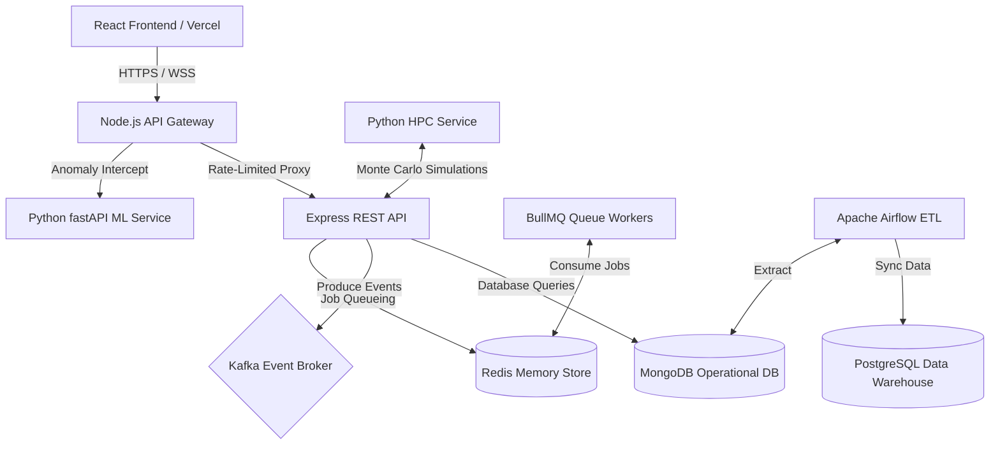

# 🌟 AI-Smart Expense & Payroll Management System (FinAI)

> **An Enterprise-Grade FinTech SaaS Platform** featuring AI-powered expense categorization, anomaly detection, real-time interactive dashboards, advanced threat protection, and offline-first robust architecture.


---

## 🔗 Live Deployments

- **Frontend (Vercel):** [https://frontend-pearl-iota-11.vercel.app](https://frontend-pearl-iota-11.vercel.app)
- **Backend (Railway):** [Live Backend API endpoints](https://railway.app) (Associated with this repo)

---

## 🏗️ System Architecture

FinAI utilizes a modern **Distributed Microservices Architecture** connecting robust backend processes, ML services, and a dynamic frontend.



---

## ✨ Key Features

| Category | Features |
| -------- | -------- |
| **Authentication & Security** | FAANG-tier JWT access/refresh rotation, immediate reuse revocation, Rate-limiting, Helmet headers, Multi-tenant DB isolation. |
| **AI Integration** | Intelligent expense categorization, Anomaly detection, Deep semantic data search (LangChain + Ollama), Policy filters preventing SQL/Prompt injection. |
| **Expense & Payroll** | Payroll processing using worker threads for high concurrency, duplicate payment safeguards, dynamic PDF salary slips. |
| **Real-time & Sync** | Offline-first sync with IndexedDB, Socket.io for live budget alerts and dashboard metrics. |
| **Data Engineering** | Apache Airflow ETL integration, PostgreSQL data warehousing, Redis-based Idempotency engine. |
| **Observability** | Integrated Prometheus metrics, OpenTelemetry, Winston centralized logging. |

---

## 💻 Tech Stack

- **Frontend:** React 18, Vite, Redux Toolkit (RTK Query), Tailwind CSS, Socket.io-client.
- **Backend:** Node.js 20, Express, TypeScript, Mongoose, BullMQ, KafkaJS.
- **Databases & Brokers:** MongoDB (Operational), Redis (Queues & Idempotency), PostgreSQL (Analytics), Kafka (Event streaming).
- **AI/ML:** Python FastAPI, LangChain, Ollama (Llama 3), Prophet Forecasting.
- **DevOps:** Docker, Docker-compose, Kubernetes (K8s), Helm, Terraform, GitHub Actions.

---

## 🚀 Quick Start (Local Sandbox)

### Prerequisites
- [Docker](https://docs.docker.com/get-docker/) & [Docker Compose](https://docs.docker.com/compose/install/)
- [Node.js 20+](https://nodejs.org/) (for local development without Docker)

### Developer Sandbox Mode (Zero Config)
FinAI features a dynamic fallback mode. If MongoDB or Redis are not running, it automatically spins up `mongodb-memory-server` and in-memory queue mocks for seamless local testing.

```bash
# 1. Clone the repository
git clone https://github.com/phanindra267/AI-Smart-Expense-Payroll-Management-System-.git
cd AI-Smart-Expense-Payroll-Management-System-

# 2. Install & Start Backend (Terminal 1)
cd backend
cp .env.example .env
npm ci
npm run dev

# 3. Install & Start Frontend (Terminal 2)
cd frontend
npm ci
npm run dev
```

### Full Infrastructure (Docker Compose)
```bash
# Start all microservices, databases, and message brokers
docker-compose up --build -d

# Pull the AI model inside the container (first time only)
docker-compose exec ollama ollama pull llama3
```

---

## 🧪 Testing and Quality Assurance

FinAI boasts a rigorous test suite achieving a **100% pass rate** for API endpoints, auth, multi-tenancy, and AI-safety filters.

```bash
cd backend
# Run all unit and integration tests
npm test

# Run tests with coverage reporting
npm run test:coverage
```

---

## 📊 API Documentation Overview

### Authentication
- `POST /api/auth/register` - Register organization & admin user
- `POST /api/auth/login` - Authenticate & obtain JWT
- `POST /api/auth/refresh` - Rotate session tokens

### Employees & Expenses
- `GET/POST /api/employees` - Manage employees & adjustments
- `GET/POST /api/expenses` - Manage expenses
- `GET /api/expenses/search` - Semantic AI search

### Payroll & Budgets
- `POST /api/payroll/process` - Finalize payroll (with double-payment guards)
- `GET /api/payroll/:id/slip` - Download salary slip PDF
- `POST /api/budgets` - Manage dynamic organizational budgets

### System Health & AI
- `POST /api/ai/chat` - Interact with the Financial AI Agent
- `GET /health` - Holistic system status check
- `GET /metrics` - Prometheus observability scrape endpoint

---

## 🤝 Contributing & License
This project is open-source under the **MIT License**. Feel free to use, modify, and commercialize the application. Pull requests and feature suggestions are highly welcomed!
